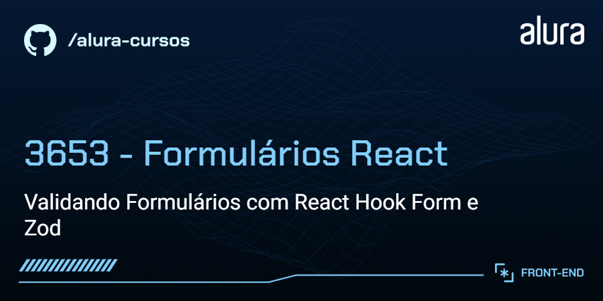
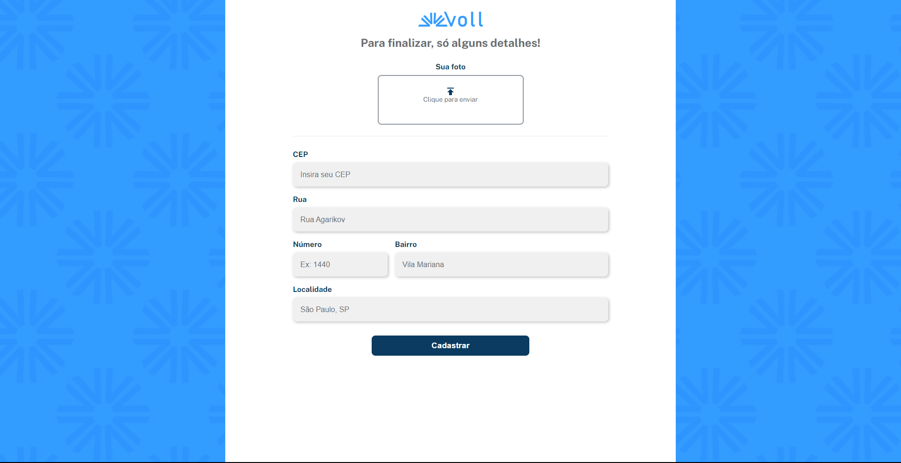

# Voll

A Voll med é um clínica especializada em conectar os profissionais certos aos clientes. Atualmente está na fase de desenvolvimento de seu site e app, que conta com uma grande quantidade de funcionalidades.

Uma dessas funcionalidades são os seus formulários, que incluem validação para garantir a correta entrada dos dados dos clientes.



## 🔨 Funcionalidades do projeto

Neste estágio de desenvolvimento, a Voll possui as seguintes funcionalidades:

-   Formulário de cadastro de paciente
-   Formulário de cadastro de médicos especialistas

## ✔️ Técnicas e tecnologias utilizadas

O projeto utiliza as seguintes tecnologias e bibliotecas:

-   `React` - Framework JavaScript
-   `Vite` - Build tool para desenvolvimento rápido
-   `TypeScript` - Linguagem de programação principal
-   `Styled Components` - Ferramenta de estilização do nosso projeto
-   `React Hook Form` - Biblioteca para gerenciamento de formulários
-   `Zod` - Biblioteca de criação de esquemas de validação

E muito mais...

## 🛠️ Abrir e rodar o projeto

Para executar o projeto Meteora em seu ambiente local, siga estas etapas:

1. Certifique-se de ter o Node.js instalado em sua máquina.

2. Baixe o repositório do projeto.

3. Extraia os arquivos para uma pasta de sua preferência.

4. Navegue até a pasta em questão via terminal (cmd):

    ```
    cd voll-rhf-zod
    ```

5. Instale as dependências usando o npm:

    ```
    npm install
    ```

6. Inicie o projeto localmente:

    ```
    npm run dev
    ```
